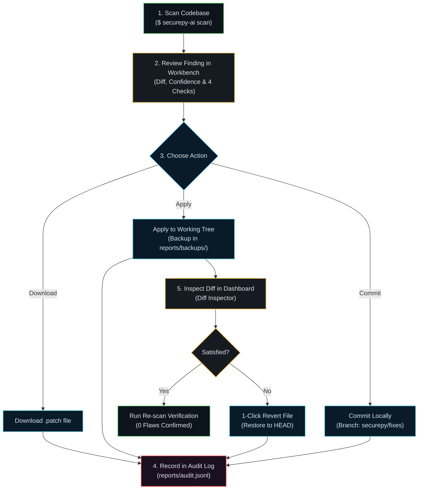

# Phase 10.4 — Remediation Audit Trail, Git Working Tree Inspector & 1-Click Revert

> **Full Observability & Complete Human Control for AI-Assisted Security Remediation**

---

## 1. Overview & Problem Statement

Phase 10.3 introduced local patch application (`download .patch`, `apply → working tree`, `commit locally`).  
**Phase 10.4** completes the governance loop with:

1. **Working Tree Changes Inspector**: Displays uncommitted local modifications made by SecurePy AI in real-time.
2. **Live Git Diff Viewer**: Allows inspecting unified line diffs for modified files without leaving the dashboard.
3. **1-Click File Revert**: Safely runs `git checkout -- <file>` over the API to restore any modified file back to pristine git HEAD.
4. **Remediation Audit Trail Ledger**: Reads from `reports/audit.jsonl` and renders an auditable trail of all security actions (`apply`, `patch_file`, `revert`, `apply_rejected`, `commit`).
5. **Re-Scan Verification**: Instantly re-scans modified targets to confirm that the security flaw was successfully eradicated.

---

## 2. API Endpoints (`server.py`)

### `GET /api/git/status`
Returns branch name, dirty state, and list of modified files.
```json
{
  "is_repo": true,
  "branch": "phase-9-test",
  "dirty": true,
  "changed": ["M examples/vulnerable.py"]
}
```

### `GET /api/git/diff?file_path=<path>`
Returns the raw unified git diff of uncommitted changes.
```json
{
  "diff": "diff --git a/examples/vulnerable.py b/examples/vulnerable.py\n...",
  "ok": true
}
```

### `POST /api/git/revert`
Reverts working tree modifications for a file.
```json
// Request
{
  "file_path": "examples/vulnerable.py"
}

// Response
{
  "reverted": true,
  "file": "examples/vulnerable.py",
  "err": ""
}
```

### `GET /api/audit`
Returns chronological audit log entries from `reports/audit.jsonl`.
```json
{
  "entries": [
    {
      "time": "2026-08-15T16:00:00Z",
      "action": "apply",
      "finding": "SEC102:examples/vulnerable.py:16",
      "file": "examples/vulnerable.py",
      "mode": "working_tree"
    },
    {
      "time": "2026-08-15T16:01:00Z",
      "action": "revert",
      "file": "examples/vulnerable.py",
      "ok": true
    }
  ]
}
```

---

## 3. The Full Remediation Lifecycle



---

## 4. Frontend Components in `dashboard/src/App.jsx`

1. **Working Tree Modifications Card**:
   - Displays real-time status: `● N modified` or `✓ clean`.
   - Action buttons: `Inspect Diff` and `Revert`.
2. **Diff Inspector Modal/Viewer**:
   - Renders the unified diff with additions and deletions syntax highlighting.
3. **Remediation Audit Trail Card**:
   - Color-coded badges for `[APPLY]`, `[PATCH_FILE]`, `[REVERT]`, `[COMMIT]`, and `[APPLY_REJECTED]`.
4. **Safety Guarantees**:
   - Strict root jail check (cannot modify or revert files outside the workspace).
   - Stale-patch snippet guard (refuses to apply if the underlying code changed).
   - Never pushes to remote repositories.
