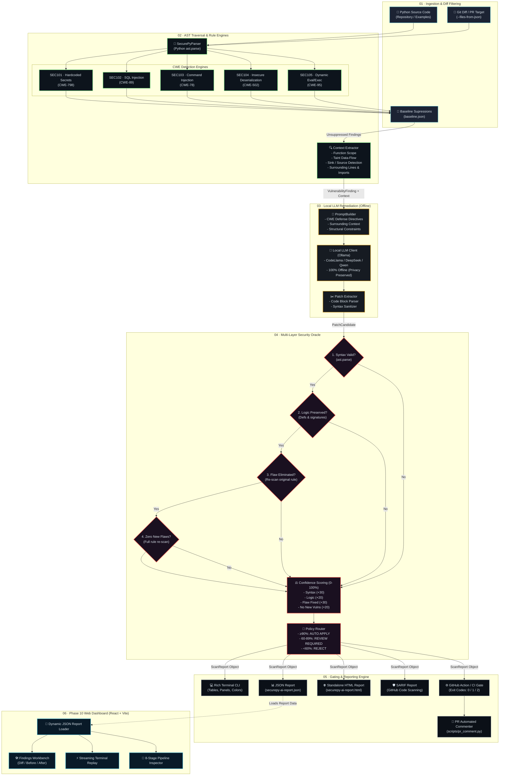
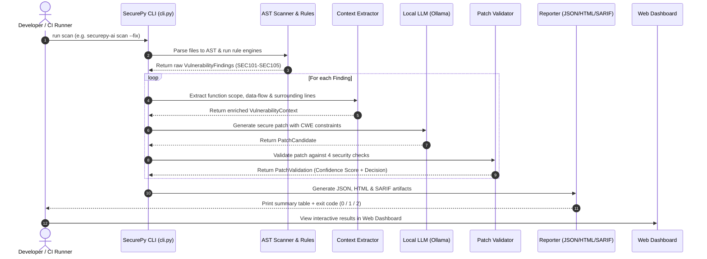
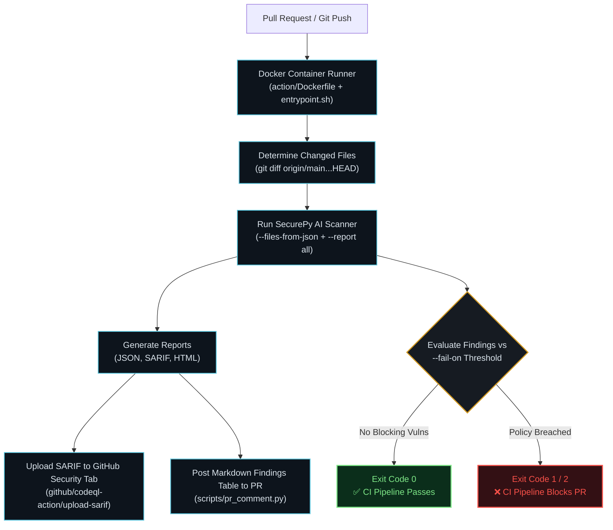

# SecurePy AI — Complete System Architecture

> **Context-Aware Static Analysis (SAST) with Local LLM Remediation, Security Oracle Validation, and CI/CD Gating**

---

## 1. High-Level End-to-End Architecture

---

## 2. Component Pipeline Sequence

---

## 3. Four-Layer Security Oracle Architecture (Phase 6)

```mermaid
flowchart LR
    classDef step fill:#0d141c,stroke:#7ee787,stroke-width:1.5px,color:#dbe4ec
    classDef pass fill:#0b2e1b,stroke:#7ee787,stroke-width:2px,color:#7ee787
    classDef fail fill:#331014,stroke:#f85149,stroke-width:2px,color:#f85149
    classDef decision fill:#161b22,stroke:#d29922,stroke-width:2px,color:#dbe4ec

    PATCH["Candidate Patch Code"] --> S1["1. Syntax Check\n(ast.parse)"]:::step
    
    S1 -->|Valid Python| P1["+30 pts"]:::pass
    S1 -->|SyntaxError| F1["0 pts"]:::fail
    
    P1 --> S2["2. Logic Check\n(Definitions Preserved)"]:::step
    F1 --> S2
    
    S2 -->|Names Intact| P2["+20 pts"]:::pass
    S2 -->|Defs Removed| F2["0 pts"]:::fail
    
    P2 --> S3["3. Flaw Elimination\n(Re-scan Target Rule)"]:::step
    F2 --> S3
    
    S3 -->|Flaw Cleared| P3["+30 pts"]:::pass
    S3 -->|Still Vulnerable| F3["0 pts"]:::fail
    
    P3 --> S4["4. Zero Side-Effects\n(All Rules Re-scan)"]:::step
    F3 --> S4
    
    S4 -->|Clean AST| P4["+20 pts"]:::pass
    S4 -->|New Flaw Found| F4["0 pts"]:::fail
    
    P4 & F4 --> TOTAL["Total Confidence Score\n(0% to 100%)"]:::decision
    
    TOTAL -->|Score ≥ 90%| D1["🟢 AUTO APPLY\n(Safe to commit)"]:::pass
    TOTAL -->|60% ≤ Score < 90%| D2["🟡 REVIEW REQUIRED\n(Manual sign-off)"]:::decision
    TOTAL -->|Score < 60%| D3["🔴 REJECTED\n(Unsafe candidate)"]:::fail
```

---

## 4. CI/CD & GitHub Actions Gating Architecture (Phase 9)

---

## 5. Directory & Module Mapping

| Layer | Files / Directories | Responsibility |
|---|---|---|
| **Core Models** | [`securepy_ai/models.py`](file:///c:/Users/SAAGAR%20PORWAL/Desktop/sem%203/coding/securePy%20AI/securepy_ai/models.py) | Data contracts (`VulnerabilityFinding`, `PatchCandidate`, `PatchValidation`, `ScanReport`) |
| **AST Scanner** | [`securepy_ai/scanner/`](file:///c:/Users/SAAGAR%20PORWAL/Desktop/sem%203/coding/securePy%20AI/securepy_ai/scanner) | AST parsing, node visitors, CWE detection rules (SEC101–SEC105), context & taint extraction |
| **LLM Remediator** | [`securepy_ai/remediator/`](file:///c:/Users/SAAGAR%20PORWAL/Desktop/sem%203/coding/securePy%20AI/securepy_ai/remediator) | Structured prompt generator, Ollama/Mock clients, code extraction, and 4-tier PatchValidator |
| **Reporting** | [`securepy_ai/reporter/`](file:///c:/Users/SAAGAR%20PORWAL/Desktop/sem%203/coding/securePy%20AI/securepy_ai/reporter) | JSON, standalone interactive HTML, and SARIF v2.1.0 report writers |
| **CLI & Policy Engine**| [`securepy_ai/cli.py`](file:///c:/Users/SAAGAR%20PORWAL/Desktop/sem%203/coding/securePy%20AI/securepy_ai/cli.py) | Rich terminal interface, exit codes (0/1/2), diff-only scanning, baseline filtering |
| **GitHub Action** | [`action/`](file:///c:/Users/SAAGAR%20PORWAL/Desktop/sem%203/coding/securePy%20AI/action), [`scripts/pr_comment.py`](file:///c:/Users/SAAGAR%20PORWAL/Desktop/sem%203/coding/securePy%20AI/scripts/pr_comment.py) | Docker container, entrypoint automation, PR Markdown summary poster |
| **Web Dashboard** | [`dashboard/`](file:///c:/Users/SAAGAR%20PORWAL/Desktop/sem%203/coding/securePy%20AI/dashboard) | React + Vite security operations console, live report loader, diff workbench |
| **Legal Protection** | [`LICENSE`](file:///c:/Users/SAAGAR%20PORWAL/Desktop/sem%203/coding/securePy%20AI/LICENSE) | PolyForm Noncommercial License 1.0.0 (Intellectual property protection) |
